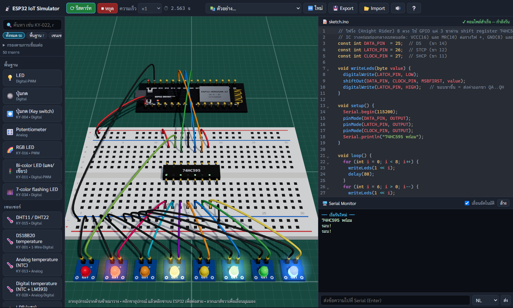

# ESP32 IoT Simulator (WebGL)

เว็บจำลองบอร์ด **ESP32** กับเซนเซอร์และโมดูลกว่า 50 ชนิดในฉาก 3 มิติ คุณลากอุปกรณ์มาวาง ต่อสายหรือเสียบลงเบรดบอร์ด เขียนโค้ด **Arduino C++** แล้วกดรันได้ทันทีในเบราว์เซอร์ ไม่ต้องมีบอร์ดจริงและไม่ต้องมีเซิร์ฟเวอร์



## เริ่มใช้งาน

```bash
cd iot-sim
npm install
npm run dev        # เปิด http://localhost:5173
```

`npm run build` จะสร้างเว็บแบบ static ไว้ใน `dist/` ซึ่งนำไปวางบนโฮสต์ใดก็ได้ เช่น GitHub Pages หรือ Netlify เพราะใช้ path แบบ relative

## ความสามารถ

- **ฉาก 3D (Three.js / WebGL):** มีบอร์ด ESP32 DevKit V1 แบบ 30 ขา ชื่อขาตรงกับบอร์ดจริง หมุน ซูม และเลื่อนมุมมองได้
- **ค้นหาอุปกรณ์:** ช่องค้นหาด้านบนแถบอุปกรณ์ (กด `/`) ค้นได้ทั้งชื่อไทย ชื่ออังกฤษ และรหัสโมดูล เช่น `KY-022`, `ky022`, `relay`, `แม่เหล็ก` กด `Enter` เพื่อวางผลลัพธ์แรก และกรองได้ตามหมวด (ชิป) และตามการเชื่อมต่อ (Digital / Analog / PWM / I2C / SPI / 1-Wire / IR / Power)
- **ลากและวาง:** ลากอุปกรณ์จากแถบซ้ายลงฉาก ลากเพื่อย้าย กด `R` เพื่อหมุน กด `Delete` เพื่อลบ
- **เบรดบอร์ด:** วางโมดูลหรือ IC บนเบรดบอร์ด ขาจะเลื่อนลงรูให้ตรงกริดเองและเสียบอัตโนมัติ
  - ในแต่ละคอลัมน์ รู a–e ต่อถึงกัน และรู f–j ต่อถึงกัน รางไฟ +/− ยาวตลอดแนว
  - ชี้เมาส์ที่รูเพื่อดูว่ารูนั้นต่อกับอะไรบ้าง (แถบที่ต่อกันจะเรืองสีเขียว)
  - ลากเบรดบอร์ดแล้วอุปกรณ์ที่เสียบอยู่จะย้ายตามไปด้วย
- **ต่อสาย:** คลิกขาใดก็ได้ แล้วคลิกอีกขาหนึ่ง ทำได้ทั้งขาอุปกรณ์ ขา ESP32 และรูเบรดบอร์ด หรือเลือกขา ESP32 จาก dropdown ในแผงคุณสมบัติก็ได้ สีสายตั้งให้อัตโนมัติ (แดง = ไฟ, ดำ = GND)
- **จำลองวงจร:** ระบบคำนวณ net จากสายไฟ รูเบรดบอร์ด ปุ่มหรือสวิตช์ที่กดอยู่ และหน้าสัมผัสรีเลย์
  - แหล่งจ่ายไฟ (MB102, MP1584EN) จ่ายไฟเข้ารางได้จริง
  - ถ้าไฟเลี้ยงต่อชนกับ GND ระบบจะเตือนว่าลัดวงจร
- **ตัวแก้ไขโค้ด** (CodeMirror): มี syntax highlight แจ้ง error พร้อมเลขบรรทัด และรันได้ด้วย `Ctrl+Enter`
- **Serial Monitor:** ส่งข้อความเข้า `Serial.read()` ได้
- **ปรับค่าเซนเซอร์ระหว่างรัน:** ใช้แถบเลื่อนในแผงคุณสมบัติ หรือคลิกที่ตัวอุปกรณ์ในฉาก
  - ปุ่มกด: คลิกค้าง
  - สวิตช์เอียงและแม่เหล็ก: คลิกเพื่อสลับ
  - เซนเซอร์เคาะและสั่นสะเทือน: คลิกเพื่อกระตุ้น
  - Rotary encoder: หมุนล้อเมาส์เหนือลูกบิด
  - จอยสติก: ลากในแผง
  - IR receiver: มีรีโมตเสมือนให้กด
  - SD card: มีหน้าดูไฟล์ในการ์ด
  - DS1302: ตั้งเวลา RTC ได้
- **เสียงจริง** จาก `tone()` และเสียงคลิกของรีเลย์ ผ่าน WebAudio
- ปรับความเร็วการจำลองได้ ×0.25 ถึง ×5
- บันทึกงานอัตโนมัติใน localStorage และ Export/Import เป็นไฟล์ `.json` ได้ ไฟล์ในการ์ด SD และเวลาของ RTC บันทึกไปกับโปรเจกต์ด้วย
- **ตัวอย่างที่ต่อสายไว้แล้ว 16 ตัวอย่าง:**
  - Blink
  - ปุ่มกด
  - Pot → Servo
  - DHT22 → OLED
  - HC-SR04 ถอยจอด
  - PIR กันขโมย
  - RGB ไล่สี
  - นาฬิกา LCD
  - ไฟวิ่ง 74HC595 บนเบรดบอร์ด
  - รีโมต IR
  - รดน้ำต้นไม้อัตโนมัติ (Soil + Relay)
  - MPU6050 วัดมุมเอียง
  - บันทึกอุณหภูมิลง SD
  - นาฬิกา DS1302
  - Rotary encoder
  - ปรบมือเปิดไฟ

### อุปกรณ์

| กลุ่ม | อุปกรณ์ |
|---|---|
| พื้นฐาน | LED, ปุ่มกด, Key switch (KY-004), Potentiometer, RGB LED (KY-016 / KY-009), Bi-color LED (KY-011 / KY-029), 7-color flashing LED (KY-034) |
| เซนเซอร์ | DHT11 / DHT22 (KY-015), DS18B20 (KY-001), NTC แบบแอนะล็อก (KY-013), NTC + LM393 (KY-028), LDR (KY-018), HC-SR04, PIR, IR obstacle (KY-032), Line tracking (KY-033), Soil moisture, Water level, Flame (KY-026), Microphone (KY-037 / KY-038), Heartbeat (KY-039), Metal touch (KY-036), Joystick (KY-023), Rotary encoder (KY-040), MPU6050 (GY-521), Hall (KY-003 / KY-024 / KY-035), Reed (KY-021 / KY-025), Tilt (KY-020), Mercury (KY-017), Magic light cup (KY-027), Vibration (KY-002), Knock (KY-031), Photo interrupter (KY-010) |
| แอคชูเอเตอร์ | Servo SG90, Buzzer active/passive (KY-012 / KY-006), Relay 5V (KY-019), Laser (KY-008) |
| จอแสดงผล | OLED 0.96" SSD1306 (I2C), LCD 16×2 I2C |
| สื่อสาร / เก็บข้อมูล | IR receiver (KY-022), IR transmitter (KY-005), SD card reader (SPI), DS1302 RTC |
| แหล่งจ่ายไฟ | Breadboard power module MB102, MP1584EN buck converter |
| เบรดบอร์ด / IC | Breadboard 400 รู, 74HC595 shift register (DIP-16, ต่อพ่วงหลายตัวได้) |

อุปกรณ์ที่มีขา VCC/GND ต้องต่อไฟก่อนจึงจะทำงาน (VCC → 3V3 หรือ VIN, GND → GND) เหมือนของจริง

โมดูลประเภทสวิตช์ (KY-002/003/004/010/017/020/021/027/031) มี pull-up 10kΩ ในตัว เมื่อสวิตช์ต่อ ขา S จะเป็น LOW ส่วนโมดูลที่มี comparator LM393 (ขา AO + DO) ปรับจุดตัดของ DO ได้ด้วยแถบ "trimpot" ในแผงคุณสมบัติ

### API และไลบรารีที่รองรับ

- **Core:** `pinMode`, `digitalWrite/Read`, `analogRead` (12-bit), `analogWrite`, LEDC (`ledcSetup/ledcAttachPin/ledcWrite` และ `ledcAttach` ของ core 3.x), `tone/noTone`, `pulseIn`, `shiftOut/shiftIn`, `millis/micros/delay`, `attachInterrupt`, `map/constrain/random`, คณิตศาสตร์, `String`, `sprintf/snprintf_P`
- **Serial:** `print/println/printf`, `available/read/readString/readStringUntil/parseInt`
- **ไลบรารี:**
  - `DHT.h`, `ESP32Servo.h`, `WiFi.h` (จำลองการเชื่อมต่อ)
  - `Adafruit_SSD1306.h` + `Adafruit_GFX` (ข้อความ เส้น สี่เหลี่ยม วงกลม สามเหลี่ยม bitmap), `LiquidCrystal_I2C.h`
  - `Wire.h`: I2C scanner และการอ่าน register ตรง ๆ ของ MPU6050
  - `OneWire.h` + `DallasTemperature.h` (DS18B20)
  - `Adafruit_MPU6050.h` (`sensors_event_t`)
  - `IRremote.hpp` (4.x: `IrReceiver`, `IrSender.sendNEC` และ API เก่า `IRrecv` / `decode_results`)
  - `SD.h` / `FS.h` (`File`, `openNextFile`, `fs::FS`)
  - `ThreeWire.h` + `RtcDS1302.h` (Rtc by Makuna), `virtuabotixRTC.h`
- ตัวจำลองตรวจข้อผิดพลาดที่พบบ่อยและแจ้งเตือน เช่น:
  - ลืมเรียก `pinMode`
  - ใช้ `analogRead` กับขาที่ไม่ใช่ ADC หรือใช้ ADC2 ขณะเปิด WiFi
  - สั่ง OUTPUT ที่ขา 34–39
  - หารด้วยศูนย์ หรือ index ของ array เกินขอบเขต
  - ต่อขา SPI หรือ CS ของการ์ด SD ไม่ถูก
  - หาอุปกรณ์ I2C ไม่พบ
  - ไฟลัดวงจร

### ข้อจำกัด

ตัวจำลองแปลงโค้ด C++ เป็น JavaScript แล้วรันใน Web Worker ไม่ได้จำลองชุดคำสั่ง Xtensa ของ ESP32 วงจรจำลองระดับลอจิกและแรงดันโดยประมาณ ไม่ได้คำนวณกระแสหรือค่าความต้านทาน (LED แต่ละโมดูลมีตัวต้านทานในตัว)

**ภาษาที่รองรับ** คือส่วนที่ใช้บ่อยใน sketch:
- ตัวแปร, array หลายมิติ, `struct`, `enum`
- ฟังก์ชัน (มี default argument และ recursion), `switch`, range-for
- `#define` (macro แบบมีพารามิเตอร์ก็ได้), `static` local
- template ของคลาสไลบรารี เช่น `RtcDS1302<ThreeWire>`

**ยังไม่รองรับ:**
- pointer (ยกเว้น `char*` และการส่งอ็อบเจกต์ด้วย `&`)
- การประกาศ `class` เอง
- reference ของชนิดพื้นฐาน, function overloading
- HTTP และ MQTT

## โครงสร้างโค้ด

```
src/
  compiler/   lexer + preprocessor, compiler C++ → JS (ฟังก์ชันกลายเป็น generator เพื่อหยุดที่ delay ได้)
  runtime/    Arduino API, ไลบรารีจำลอง (libs/), 74HC595 ระดับบิต, scheduler นาฬิกาเสมือน (machine.ts), Web Worker
  sim/        ขาของ ESP32, โมเดลโปรเจกต์, netlist (สายไฟ + เบรดบอร์ด + สวิตช์ → net), Simulator (ส่ง input/output กับ worker)
  components/ อุปกรณ์แต่ละตัว: โมเดล 3D, ขา, ค่าที่ปรับได้, พฤติกรรมทางไฟฟ้า (kit.ts = factory ของโมดูลชุด KY)
  scene/      Three.js: ฉาก, ลากวาง, ต่อสาย, โมเดล ESP32
  ui/         editor, palette (ค้นหา/กรอง), inspector, serial monitor, เสียง
  examples/   ตัวอย่างพร้อมการต่อสาย
```

### เพิ่มอุปกรณ์ใหม่

สำหรับโมดูลทั่วไป ให้ใช้ `kit({...})` ใน `src/components/kit.ts` ส่วนอุปกรณ์แบบอื่นให้สร้าง `ComponentDef` เอง (ดู `src/components/types.ts`) ซึ่งกำหนดได้ดังนี้:

| ส่วน | ใช้ทำอะไร |
|---|---|
| `pins`, `props` | ขาและค่าที่ปรับได้ |
| `size` / `pinLayout` | ขนาดบอร์ดและตำแหน่งขา (ใช้ตอนเสียบลงเบรดบอร์ด) |
| `build()` | สร้างโมเดล 3D |
| `inputs()` | ส่งสัญญาณเข้า firmware หรือเข้า net |
| `shorts()` | กลุ่มขาที่ต่อถึงกันในขณะนั้น เช่น สวิตช์หรือรีเลย์ |
| `sources()` | ขาที่จ่ายไฟ |
| `render()` | อัปเดตภาพตาม output |
| `panel()` | UI เพิ่มเติมในแผงคุณสมบัติ |
| `keywords`, `tags` | ใช้สำหรับช่องค้นหา |

เสร็จแล้วเพิ่มอุปกรณ์เข้าไปใน `src/components/registry.ts`

## ทดสอบ

```bash
npm test                    # unit test: compiler, runtime, netlist/เบรดบอร์ด, ไลบรารีโมดูล, การค้นหา, ตัวอย่างทุกตัว (vitest)
npm run e2e                 # Playwright: ลากวาง ต่อสาย เสียบเบรดบอร์ด ค้นหา กดปุ่ม รันโค้ด
PW_CHANNEL=chrome npm run e2e   # ใช้ Google Chrome ที่ติดตั้งในเครื่อง
CHROMIUM_PATH=/path/to/chrome npm run e2e
```
